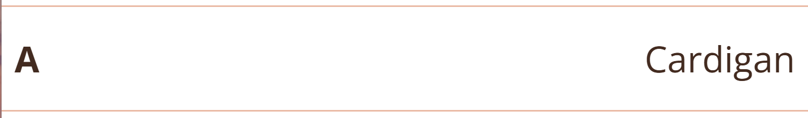

# Mobility Mapper Frontend

Open Route Service
API Returns:
An encoded polyline is a compressed format used to represent a series of geographic points (latitude and longitude) as a compact string of characters. This encoding significantly reduces the amount of space needed to store or transfer path information.


Mobility Mapper is a route finder and navigation app for users of wheelchairs, mobility scooters, tricycles and other wheeled mobility devices. 

This repository is the frontend of Mobility Mapper.

Sends a POST request to the OpenRouteService API with inputs in JSON format. 
Gets a route with details...

Visit the deployed website [here](https://sonyajane.github.io/mobility-mapper-frontend/).

## Table of Contents

## User Experience (UX)

### Business Goals

The Mobility Mapper frontend is designed to deliver an intuitive user experience, ensuring that wheelers can plan safe an accessible routes. The primary business goals are: 

* Provide a frontend to a server-based route-finding engine for wheelchair users
* Enable users to select a start and destination location and obtain a route optimised for wheelers.
* Provide the following ways of selecting a start or destination location:
    - Text search for a place or address
    - Get the current location of the user
    - Click a location on a map
    - Select from a list of user saved places

### User Stories

* As a wheelchair user, I want to enter a start and destination location, so that I can find an optimised accessible route.
* As a wheelchair user, I want to view my selected route on an interactive map, so that I can visually confirm the accessibility.
* As a user, I want to search for a place or address, so that I can select it as my start or destination location.
* As a user, I want to use my current GPS location, so that I can set it as my start or destination location.
* As a user, I want to click on a location on the map, so that I can select it as my start or destination.
* As a user, I want to select a location from my saved places, so that I can quickly choose frequently used locations.
* As a user, I want to zoom in and out of the map, so that I can view my route in more detail.
* As a user, I want the frontend to work on mobile and desktop, so that I can use it on any device.

[Back to top ⇧](#mobility-mapper-frontend)

### Colour Scheme


The primary colour used on the webb application is burnt orange, which is the same colour used for the app logo. Orange was chosen because it is associated with energy, happiness, and vitality. It is complemented with a coffee brown, and a lighter shade of burnt orange for background colours. These colours are a small subset of the general Mobility Mapper theme, as used in the [introductory website](https://sonyajane.github.io/mobility-mapper/).

### Typography

The main font used on the website is Open Sans with Sans Serif as the backup in case the former is not imported successfully. Since the application is small, there was no need for a second font. A second font was trailled, but consistency of the main font made for a more professional appearance.

### Wireframes

Wireframes were created using [Balsamiq](https://balsamiq.com/) to plan the design of the web application.


[Back to top ⇧](#mobility-mapper)

## Features

### General
* Single page app
* Responsive design across all device sizes.
* Hovering over a button or clickable section changes the cursor to a pointer to let the user know it is clickable.

### 1. Header 

The header indicates that the app is a route planner. The Mobility Mapper logo is on the right. On very small screens (<350px) the logo is replaced with the Mobility Mapper route marker, as the full logo does not fit.

| Screens < 350px | Screens >= 350px |  
| --- | --- |
|  |  |

### 2. Start location and destination location sections

This section invites the user to select a start and destination location. There is a section for the start location, followed by one for the destination location. 


The start location is indicated with the letter A, and the destination with the letter B. On the right, the text invites the user to select either the start or destination location.

Hovering over either section changes the mouse cursor to a pointer, and the section background changes to a light orange, to indicate that the section is clickable.


When the user has seletced a location using the section described below, it is displayed in place of the invitation to choose a location.



### 3. Location selection options

When a user clicks on either the start or destination location section, the section shown below is created below the clicked section. this is referred to as the location selection options section. It is highlighted with a light orange background to indicate that this is what the user is currently working on.


A user can then choose a location using one of the following four methods.

#### a) Text search 

The user can type in the text input and then click on the magnifying glass button to search for a location. 


The input is first validated. If it does not contain any letters or whole numbers, the input is cleared and an error message in red font is added to the input field as a placeholder.


If the input contains letters and or whole numbers, it is sent to the Open Street Maps (Nominatim search API)[https://nominatim.org/release-docs/latest/api/Search/] to look up a location. We use the parameter `format=json` to obtain the response in json format, and `addressdetails=1` to include a breakdown of the address. 

If the request is a success, all sections except the header and the text search input row are hidden. 

Then for each search result, we:

1. Extract the addresstype attribute, which tells us the type of place the result represents, such as a building, street, village, or administrative region.
2. Extract the display_name attributes, which is the full, comma separated address in a single string. 
3. Extract the longitude and latitude, which will be required for the route generation process.
4. Diplay both the addresstype and display_name in a div, and attach to the div the latitude, longitude, and display_name as data attributes. This enables the required information to be picked up if that search result is selected by the user.

An example of the displayed results are shown in the image below. 


If the request was unsuccessful, an error message is shown in the error modal, as shown in the image below.


The user can then either select one of the return locations by clicking on the corresponding div, or exit and return to the previous screen by clicking the exit button. If they select one of the locations, then:
(scripts/display-search-location-results.js)

1. Get the latitude, longitude and place name from the clicked div by calling the function getClickedLocation
2. Check the placename is not undefined, and if it is, replace with "Selected location"
3. Set the text of the start or destination div to the given place name setStartEndLocationText
4. The corresponding location marker is added to the map by calling the function displayLocationOnMap. Any existing markers of the same type are removed first.
5. The latitude and longitude are added to the global route coordinates variable addCoordinatesToRoute
6. Remove the search results div
7. Show the hidden elements
8. Remove the orange background from the waypoint divs
9. remove the waypoint-selection-options div

Resulting screen after a locating is selected:


#### b) Current location

The user can click this button to set their current location as the start or destination location. 


We get current user's location using Leaflet's locate method by calling locateUser, and if successful, we 

1. Display the location on the map using a marker displayLocationOnMap. Any existing markers of the same type are removed first.
2. Get place name from lat and lon by calling latLonToAddress, which calls Nominatims reverse geocoding API to generate an address from a latitude and longitude. If the response is not ok, we set the placename to "Unknown location".
3. Display the place name in the start/destination location div
4. The latitude and longitude are added to the global route coordinates variable addCoordinatesToRoute

#### c) Map select

The user can click the Map Select button, or click on the map at any time without going through the location selection options section. Doing so via the location selection options section hides everything except the header and the map, making more space for the map and making it easier for the user to view.


On clicking on a location on the map, we

1. Get the latitude and longitude of the clicked point
2. Get place name from lat and lon by calling latLonToAddress, which calls Nominatims reverse geocoding API to generate an address from a latitude and longitude. If the response is not ok, we set the placename to "Unknown location".
3. If not already hidden, hide everything except the map and header.
4. Call showClickedLocationDiv to add a popup div at bottom of screen, below the map, which contains
    - the location name 
    - buttons to set as start location or set as destination
    - a button to close the popup and return to the main screen


5. Add click event listeners to the buttons addEventListenerToUseLocationButton, addEventListenerToExitButton.
6. Remove any existing blue location markers and add a blue location marker at the clicked location.
7. Center the map on the clicked point and zoom in to the location.

If the user clicks 'Start here' 'Set as desination'), we:

1. remove the start (destination) marker
2. Change the blue location marker to a start (destination) marker
3. Display the place name in the start (destination) location div setStartEndLocationText.
4. Remove the popup div at the bottom of the screen.
5. Show the previously hidden divs
6. Resizes the map to fit the new container size
7. Reset the map view to centre on the selected location
8. The latitude and longitude are added to the global route coordinates variable addCoordinatesToRoute


#### d) Saved places

The user can click the Saved Places button to select a location from their list of saved places. Note that the list is an object defined in index.js as follows:

``` javascript
MM.savedPlaces = [{ name: "Home", lat: 51.463913, lon: -3.162759, address: "1 Home Street, Cardiff" },
                      { name: "Work", lat: 51.485925, lon: -3.176533, address: "1 Work Street, Cardiff" },
                      { name: "Dentist", lat: 51.519471, lon: -3.117880, address: "1 Dentist Street, Cardiff" }];

```


On clicking the Saved Places button, we:

1. Hide everything except the header
2. Call showSavedPlaces to show the list of user saved places.
3. This creates a new 'saved places' div with a title and an exit button.
4. Add an event listener to the exit button, which 
    a) Removes the saved places div
    b) Shows the hidden elements
    c) Resets the map
5. Iterate through the saved places:
    a) Create a new div for each result.
    b) Add the place name, address and latitude and longitude.
    c) Include a classes that turn the cursor to a pointer, and the background to light orange on hovering over the div.
    d) Add data attributes to the div, including place name and latitude and longitude.
    e) Add an event listener to the div for clicking the location. 
    f) Append the 'place' div to the 'saved places' div
6. Append the 'saved places' div to the main element.

Then the user can click on one of the places. On doing so, we

1) Display the place name in the start or destination div setStartEndLocationText(place.name, outputDivId);
2) Display the location on the map with a start or destination marker, first removing any existing markers of the same type.
4) Remove the saved places div.
5) Show the hidden elements.
6) Add the lat and lon to global route coordinates.

### 4. Map
The map is initialised in index.js by calling initialiseMap. The map is created using the Leaflet library, using OpenStreetMap tiles. 


We then get the user's location and centre the map on that location at zoom level 6. 

We then add a button that enables the user to zoom to their current location. Wehn this button is clicked:

1. We call locateUser to locate the user.
2. If that is successful we set the map view to be centered on their coordinates. (If it is not successful locateUser displays an alert that says "Could not get your location. Please allow location access.".)
3. Add a circle to the map (radius = aaccuracy in metres) for 2 seconds to indicate the accuracy of the location;

A click event listener is added to the map by cliing addMapClickListener, so that the map can be clicked at any time it is visible. When clicked the same process will occur as described in section [c) Map select](# c) Map select).

Note that we did not add a button to clear the map of the route and markers. because you can do this simply by refreshing the page.

## 4. Route generation
The route generation occurs at the end of the function addCoordinatesToRoute, where it checks if there are two sets of coordinates (start and end locations). The process is as follows:

1. Prepare for a new route by calling prepareForNewRoute, which removes any existing route and extends the map bounds to include the start and end markers.
2. Generate the route by calling generateRoute. This function generates a wheelchair accessible route by calling the [OpenRouteService API directions service](https://openrouteservice.org/dev/#/api-docs) using the global start and destination coordinates. We use a POST request, specifying "wheelchair" as the mode of transport in the API URL, and attaching the coordinates and settings in the `body` as a JSON object.
3. If successful, we call displayRoute, and is unsuccessful we call displayRouteGenerationError. The latter displays a message in the error modal, with title "Route generation error" and message "No route found. Please try again with different locations."
4. The displayRoute function processes the data, which is returned in JSON format, and displays the route on the map as follows:
    a) Get the encoded polyline (series of coordinates) from the response
    b) Decode the polyline into a series of [lat, lng] pairs.
    c) Add the polyline to the map
    d) Get the bounds of the route, and start and end markers and make sure they all fit on the map.
    e) Check if the route start differs from the start marker location. This might happen if no path or road network coincides with the start or destination coordinates, thus creating a gap between their markers and the route polyline.
    f) If there is a gap, add a dashed line between the marker and route start or end.


## Technologies Used

### Languages Used
* [HTML5](https://en.wikipedia.org/wiki/HTML5)
* [CSS3](https://en.wikipedia.org/wiki/CSS)
* [Javascript](https://en.wikipedia.org/wiki/Javascript)

### Frameworks, Libraries and Programs Used

* [Google Fonts](https://fonts.google.com/) was used to import the fonts Open Sans and Bitter into the style.css file. Bitter was used for headings, and Open Sans for other text, including regular paragraphs, labels and links. 

* [Bootstrap](https://getbootstrap.com/) is an extensive library of CSS and JavaScript utilities. This website makes use of a wide range of pre-styled components such as buttons, forms, a modal, and navigation bar, along with a responsive grid system that simplifies the development of layouts for different screen sizes. Bootstrap enables consistent styling and behaviour across browsers, while also reducing the time and effort required to write custom code. 

    Bootstrap’s compiled CSS and JS was included via CDN by placing the jsdeliver `link` tag in the `<head>` for the CSS, and the `<script>` tag for the JavaScript bundle before the closing `<body>` tag.

* [Bootstrap Icons](https://icons.getbootstrap.com/) were imported into the style.css file and used in both pages to create a better visual experience for UX purposes. 

* [Leaflet]() Leaflet is a lightweight, open-source JavaScript library for interactive maps, with a user-friendly API, and mobile optimisation.

* [GIMP](https://www.gimp.org/) (GNU Image Manipulation Program) was used to:
    - reduce the file size of the images for the website;
    - crop and edit images.

* [Inkscape](https://inkscape.org/) was used to create the Mobility Mapper logo, and the route markers.

* [GitHub](https://github.com/) was used as follows:
    - Together with Git for version control and code hosting.
    - This README file serves as the main documentation for the project. 
    - GitHub Pages hosts this website directly from this GitHub repository.

* [Balsamiq](https://balsamiq.com/) was used to create the wireframes during the design phase of the project.

* [Am I Responsive?](https://ui.dev/amiresponsive) was used to view the responsiveness of the website throughout the development process.

* [Am I Responsive (.co.uk)](https://amiresponsive.co.uk/) was used to generate the mockup images used at the top of this README.

* [Responsive Design Checker](https://www.responsivedesignchecker.com/)
    - Responsive Design Checker was used in the testing process to check responsiveness on various devices.

* [Chrome DevTools](https://developer.chrome.com/docs/devtools/) was used during the development process to:
    - view how the code renders in a web browser
    - evaluate how the code functions and ensure it behaves as expected
    - test responsiveness
    - debug and refine code

* [W3C Markup Validator](https://validator.w3.org/)
    - W3C Markup Validator was used to validate the HTML code.

* [W3C CSS Validator](https://jigsaw.w3.org/css-validator/)
    - W3C CSS Validator was used to validate the CSS code.

[Back to top ⇧](#mobility-mapper)

## Testing

### Testing User Stories

1. As a first-time visitor, I need a user-friendly design with a responsive layout for my device so that I can easily access information and browse the site without frustration, regardless of the device or screen size I'm using.
    - The website is fully responsive across various devices and screen sizes.

2. As a first-time visitor, I need clear, easy-to-use navigation so I can find the information I need quickly.
    - Navigation is intuitive and easy to understand, allowing users to quickly access key sections.
    - The navigation structure is consistent across all pages and does not require more than two clicks to reach important information.
    - The navigation is accessible on both desktop and mobile, with a responsive design that adapts to different screen sizes (including a hamburger menu for mobile).
    - The navigation links and buttons are clearly labeled and distinguishable, making it easy to navigate even for first-time visitors.

3. As a busy carer of a mobility impaired person, I want to quick overview of mobility mapper so that I can determine if it's the kind of tool I'm looking for, and if it's worth my time learning more about it.
    - The top of the home page features a concise overview that explains the app’s purpose and how it benefits users of wheeled mobility devices.
    - A prominent call-to-action is available to enable the visitor to subscribe to email updates, which will provide them with both more information about Mobility Mapper, and a reminder to return to the website when they have more time to dive deeper.

4. As a user of a wheeled mobility device, I want to learn about all the features of Mobility Mapper so that I can decide if the app will suit my needs.
    - The home page includes a description of the app's key features followed by an invitation to read further details on the partnerships page.
    - The partnerships page provides further details on the problems the app solves, including a list of features that make Mobility Mapper different from existing mapping apps.

5. As a potential funder, partner, or stakeholder, I want to understand the value, impact, and business potential of the Mobility Mapper app so that I can evaluate whether it aligns with my goals and is worth my support or aligns with our funding objectives.
    - A dedicated page on the website provides a clear and compelling pitch for Mobility Mapper.
    - An introduction describes the problems the app solves for wheelers and how it solves them
    - There is a section on market potential and validation,
    - There is content differentiating Mobility Mapper from other navigation apps.
    - A section outlines the app's expected social and economic impact
    - The page includes clear, compelling visuals that highlight the app’s purpose and impact.
    - Clear calls to action for funding inquiries and contact information are present
    - Clear links on the homepage inviting the visitor to go to the partnerships page

6. As a potential user or supporter, I want to sign up for updates about the app's progress and launch so I can stay informed and be notified when the app is available.
    - A prominent call-to-action is available to enable the visitor to subscribe to email updates.
    - A confirmation of subscription is shown on clicking the submit button

7. As a social media user, I want to easily follow the Mobility Mapper app’s progress on platforms like Facebook so I can engage with the community and get regular updates.
    - Clear, visible social media buttons (e.g., Facebook) are placed on the homepage and partnerships page.


### Code Validation

* The [W3C CSS Validator](https://jigsaw.w3.org/css-validator/) website was used to validate the CSS style.css file to ensure there were no syntax errors. No errors or warnings were found.

* The [W3C Markup Validator](https://validator.w3.org/) website was used to validate the HTML files to ensure there were no syntax errors. The validator found the following errors, which were corrected:
    - An unclosed `div` tag 
    - A rogue \" was found next to a closing one

### Accessibility

Lighthouse in Chrome DevTools was used to confirm that the website is accessible. We have ensured that there is:

 - sufficient contrast between the text and background
 - meaningful alt text for images
 - semantic HTML (e.g., `header`, `nav`, `section`)
 - consistent navigation and interface design across pages
 - valid and well-structured HTML to ensure compatibility with screen readers
 - appropriate form labels
 - strategically incorporated ARIA attributes

**Lighthouse Reports**

| Home page | Partnerships page |
| --- | --- |
|  |  |


[Back to top ⇧](#mobility-mapper)

### Tools Testing

* [Chrome DevTools](https://developer.chrome.com/docs/devtools/) was used during the development process to:
    - view how the code renders in a web browser
    - evaluate how the code functions and ensure it behaves as expected
    - test responsiveness
    - debug and refine code

* Responsiveness
    
    - [Am I Responsive?](http://ami.responsivedesign.is/#) was used to check responsiveness of the pages across different devices. The tool revealed the following issues:

      - the cover title overlapped the head of the person in the home page hero image at screen size 320px. To fix this, we created a media query for screen sizes < 380px and repositioned the image slightly, and the cover title text was made smaller.
      - the hamburger menu did not fit on same line as the logo at screen size 320px. To fix this the we added to the new media query created above, such that the right hand margin was removed from the navbar-brand, and the logo size was reduced.

    - [Responsive Design Checker](https://www.responsivedesignchecker.com/) was used to check responsiveness of the pages on different screen sizes.
    
    - Chrome DevTools was used to test responsiveness on different screen sizes during the development process.
    
### Manual Testing

* Browser Compatibility

Browser | Outcome | Pass/Fail  
--- | --- | ---
Google Chrome | No appearance, responsiveness nor functionality issues.| Pass
Mozilla Firefox | No appearance, responsiveness nor functionality issues. | Pass
Microsoft Edge | No appearance, responsiveness nor functionality issues. | Pass

* Device compatibility

Device | Outcome | Pass/Fail
--- | --- | ---
Lenovo Legion Slim 7 | No appearance, responsiveness nor functionality issues. | Pass
iPad Pro 11" | No appearance, responsiveness nor functionality issues. | Pass
Samsung Galaxy Ultra 22 | No appearance, responsiveness nor functionality issues. | Pass

* Common Elements Testing

    - General

    Feature | Outcome | Pass/Fail
    --- | --- | ---
    Navigation Bar | Hover effects and links are working as expected. | Pass
    Social media links | Opens the corresponding website in a new tab. | | Pass
    Back to top button | Scrolls up to the top of the page | Pass
    Footer | Hover effects and links are working as expected. | Pass

    - Contact Forms

    Feature | Outcome | Pass/Fail
    --- | --- | ---
    Input fields | All fields required and in the correct format before submission | Pass
    Submit button | Hover effect works as expected and form data is submitted to Google Sheets when clicked | Pass
    
    - Home Page Header

    Feature | Outcome | Pass/Fail
    --- | --- | ---
    Subscribe button | Hover effects are working as expected, and opens subscribe modal when clicked | Pass
    Help fund button  | Hover effects are working as expected, and navigates to partnerships page | Pass

    - Key Features and Seeking Funding Section

    Feature | Outcome | Pass/Fail
    --- | --- | ---
    Funding and partnerships button  | Hover effects are working as expected, and navigates to partnerships page | Pass
 
    - Subscribe modal

    Feature | Outcome | Pass/Fail
    --- | --- | ---
    Input fields | All fields required and in the correct format before submission | Pass
    Submit button | Hover effect works as expected and form is submitted to Google Sheets when clicked | Pass
    Close button | Hover effect works as expected and closes modal when clicked. | Pass
    
    - Partnerships Page Header
    
    Feature | Outcome | Pass/Fail
    --- | --- | ---
    Contact us button  | Hover effects are working as expected, and navigates to the business contact form at the bottom of the page | Pass

    - Contents section

    Feature | Outcome | Pass/Fail
    --- | --- | ---
    Links  | Hover effects are working as expected, and navigates to the corresponding section of the page | Pass


[Back to top ⇧](#mobility-mapper)

## Deployment

This website was developed using [Visual Studio Code](https://code.visualstudio.com/), which was then committed and pushed to GitHub using the terminal. It was deployed from the Github repository to GitHub Pages.

### Deploying on GitHub Pages

To deploy this website to GitHub Pages from its GitHub repository, take following steps:

1. Fork the repository (see [below](# Forking the Repository) for instructions on how to do this).
2. Go to the repository and click "Settings" (at the top of the page)
3. On the left-hand-side of the page, under "Code and automation", click "Pages"
4. Under "Build and deployment" > "Source", from the dropdown box select "Deploy from a branch"
5. Under "branch" select "main"
6. Click the "save" button
7. After a few moments, refresh the page and a link to your deployed page will appear

### Forking the Repository
Forking a GitHub Repository makes a copy of the original repository on your GitHub account, which you can view and/or make changes without affecting the original repository. To fork a repository:

1. Log into [GitHub](https://github.com/login) or [create an account](https://github.com/join).
2. Locate the [GitHub Repository](https://github.com/SonyaJane/mobility-mapper).
3. At the top of the repository, on the right side of the page, select "Fork"
4. You should now have a copy of the original repository in your GitHub account.

### Creating a Clone
How to run this project locally:
1. Install the [GitPod Browser](https://www.gitpod.io/docs/browser-extension/ "Link to Gitpod Browser extension download") Extension for Chrome.
2. After installation, restart the browser.
3. Log into [GitHub](https://github.com/login "Link to GitHub login page") or [create an account](https://github.com/join "Link to GitHub create account page").
2. Locate the [GitHub Repository](https://github.com/SonyaJane/mobility-mapper).
5. Click the green "GitPod" button in the top right corner of the repository.
This will trigger a new gitPod workspace to be created from the code in github where you can work locally.

How to run this project within a local IDE, such as VSCode:

1. Log into [GitHub](https://github.com/login) or [create an account](https://github.com/join).
2. Locate the [GitHub Repository](https://github.com/SonyaJane/mobility-mapper).
3. Under the repository name, click "Clone or download".
4. In the Clone under the HTTPs section, copy the clone URL for the repository.
5. In your local IDE open the terminal.
6. Change the current working directory to the location where you want the cloned directory to be made.
7. Type 'git clone', and then paste the URL you copied in Step 3.

```
git clone https://github.com/SonyaJane/mobility-mapper
```
8. Press Enter. Your local clone will be created.

Further reading and troubleshooting on cloning a repository from GitHub [here](https://docs.github.com/en/free-pro-team@latest/github/creating-cloning-and-archiving-repositories/cloning-a-repository)


## Finished Product
 | Page |  Mobile | Tablet | Desktop | 
 | --- | --- | --- | --- |
 | Home |   |  |  |
| Partnerships |   |  |  |


[Back to top ⇧](#mobility-mapper)

## Credits 

### Content

- All content was written by the developer.

### Media

- Both pages
    - Mobility Mapper logo: Created by the developer in Inkscape

### Code

* [Bootstrap Docs](https://getbootstrap.com/docs/5.3/getting-started/introduction/) and [W3Schools](https://www.w3schools.com/) were consulted on a regular basis for inspiration.

[Back to top ⇧](#mobility-mapper)