# Mobility Mapper Frontend


Mobility Mapper is a route finder and navigation app for users of wheelchairs. This website is a basic frontend. It allows users to select a start and destination location, using one of four different methods. It then obtains a wheelchair accessible route from the [OpenRouteService API](https://openrouteservice.org/dev/#/api-docs).

Visit the deployed website [here](https://sonyajane.github.io/mobility-mapper-frontend/).

## Table of Contents

- [Mobility Mapper Frontend](#mobility-mapper-frontend)
  - [Table of Contents](#table-of-contents)
  - [User Experience (UX)](#user-experience-ux)
    - [Project Goals](#project-goals)
    - [User Stories](#user-stories)
    - [Colour Scheme](#colour-scheme)
    - [Typography](#typography)
    - [Wireframes](#wireframes)
  - [Features](#features)
    - [General](#general)
    - [Landing Page](#landing-page)
    - [Header](#header)
    - [Start location and destination location sections](#start-location-and-destination-location-sections)
    - [Location selection options](#location-selection-options)
      - [Text search](#text-search)
      - [Current location](#current-location)
      - [Map select](#map-select)
      - [Saved places](#saved-places)
    - [Map](#map)
    - [Route generation](#route-generation)
  - [Technologies Used](#technologies-used)
    - [Languages Used](#languages-used)
    - [Frameworks, Libraries and Programs Used](#frameworks-libraries-and-programs-used)
  - [Testing](#testing)
    - [Testing User Stories](#testing-user-stories)
    - [Code Validation](#code-validation)
    - [Accessibility](#accessibility)
    - [Tools Testing](#tools-testing)
    - [Manual Testing](#manual-testing)
  - [Deployment](#deployment)
    - [Deploying on GitHub Pages](#deploying-on-github-pages)
    - [Forking the Repository](#forking-the-repository)
    - [Creating a Clone](#creating-a-clone)
  - [Finished Product](#finished-product)
  - [Future Features](#future-features)
  - [Credits](#credits)
    - [Content](#content)
    - [Media](#media)


## User Experience (UX)

### Project Goals

The Mobility Mapper frontend is designed to deliver an intuitive user experience, ensuring that wheelchair users can plan accessible routes. The primary project goals are: 

* Provide a frontend to a server-based route-finding engine for wheelchair users.
* Enable users to select a start and destination location and obtain a route optimised for wheelers.
* Provide the following ways of selecting a start or destination location:
    - Text search for a place or address
    - Get the current location of the user
    - Click a location on a map
    - Select from a list of user saved places

### User Stories

1. As a user, I want an explanation of what the website does before I use it, so that I understand its purpose and decide if it is the tool I need.
2. As a user, I want the web application to work on mobile and desktop, so that I can use it on any device.
3. As a user, I want the user interface to be intuitive and easy to use, so that I don't need to read a manual on how to use it.
4. As a user, I want to enter a start and destination location, so that I can find an optimised accessible route.
5. As a user, I want to search for a place or address, so that I can select it as my start or destination location.
6. As a user, I want to get my current GPS location, so that I can set it as my start or destination location.
7. As a user, I want to click on a location on the map, so that I can select it as my start or destination.
8. As a user, I want to select a location from my saved places, so that I can quickly choose frequently used 9. As a user, I want to zoom in and out of the map, so that I can view my route in more detail.
10. As a wheelchair user, I want to view the generated route on an interactive map, so that I can visually confirm the accessibility.

[Back to top ⇧](#mobility-mapper-frontend)

### Colour Scheme


The primary colour used on the web application is burnt orange, which is the same colour used for the app logo. Orange was chosen because it is associated with energy, happiness, and vitality. It is complemented with a coffee brown, and a lighter shade of burnt orange for background colours. These colours are a small subset of the general Mobility Mapper theme, as used in the [introductory website](https://sonyajane.github.io/mobility-mapper/).

### Typography

The main font used on the website is Open Sans with Sans Serif as the backup in case the former is not imported successfully. Since the application is small, there was no need for a second font. A second font was trailled, but consistency of the main font made for a more professional appearance.

### Wireframes

Wireframes were created using [Balsamiq](https://balsamiq.com/) to plan the design of the web application.


[Back to top ⇧](#mobility-mapper-frontend)

## Features

### General

* Single page app
* Designed from a mobile first perspective.
* Responsive design across all device sizes.
* Hovering over a button or clickable section changes the cursor to a pointer to let the user know it is clickable.

### Landing Page

The landing page welcomes the user and explains the purpose of the app. It provides brief intructions on how to get started, and a button to close the landing page and start using the app. Note that this page is actually a div that covers the app, and is removed when the button is clicked.

| Mobile | Desktop |  
| --- | --- |
|  |  |

### Header 

The header indicates that the app is a route planner. The Mobility Mapper logo is on the right. On very small screens (<350px) the logo is replaced with the Mobility Mapper route marker, as the full logo does not fit.

| Screens < 350px | Screens >= 350px |  
| --- | --- |
|  |  |


### Start location and destination location sections

This section invites the user to select a start and destination location. There is a section for the start location, followed by one for the destination location. 


The start location is indicated with the letter A, and the destination with the letter B. On the right, the text invites the user to select either the start or destination location.

Hovering over either section changes the mouse cursor to a pointer, and the section background changes to a light orange, to indicate that the section is clickable.


When the user has seletced a location using the section described below, it is displayed in place of the invitation to choose a location.


### Location selection options

When a user clicks on either the start or destination location section, the section shown below is created below the clicked section. this is referred to as the location selection options section. It is highlighted with a light orange background to indicate that this is what the user is currently working on.


A user can then choose a location using one of the following four methods.

#### Text search 

The user can type in the text input and then click on the magnifying glass button to search for a location. 


The input is first validated. If it does not contain any letters or whole numbers, the input is cleared and an error message in red font is added to the input field as a placeholder.


If the input contains letters and or whole numbers, it is sent to the Open Street Maps (Nominatim search API)[https://nominatim.org/release-docs/latest/api/Search/] to look up a location. We use the parameter `format=json` to obtain the response in json format, and `addressdetails=1` to include a breakdown of the address. 

If the request is a success, all sections except the header and the text search input row are hidden. 

Then for each search result, we:

1. Extract the addresstype attribute, which tells us the type of place the result represents, such as a building, street, village, or administrative region.
2. Extract the display_name attributes, which is the full, comma separated address in a single string. 
3. Extract the longitude and latitude, which will be required for the route generation process.
4. Diplay both the addresstype and display_name in a div, and attach to the div the latitude, longitude, and display_name as data attributes. This enables the required information to be picked up if that search result is selected by the user.

An example of the displayed results are shown in the image below. 


If the request was unsuccessful, an error message is shown in the error modal, as shown in the image below.


The user can then either select one of the return locations by clicking on the corresponding div, or exit and return to the previous screen by clicking the exit button. If they select one of the locations, then:
(scripts/display-search-location-results.js)

1. Get the latitude, longitude and place name from the clicked div by calling the function getClickedLocation
2. Check the placename is not undefined, and if it is, replace with "Selected location"
3. Set the text of the start or destination div to the given place name setStartEndLocationText
4. The corresponding location marker is added to the map by calling the function displayLocationOnMap. Any existing markers of the same type are removed first.
5. The latitude and longitude are added to the global route coordinates variable addCoordinatesToRoute
6. Remove the search results div
7. Show the hidden elements
8. Remove the orange background from the waypoint divs
9. remove the waypoint-selection-options div

Resulting screen after a locating is selected:


#### Current location

The user can click this button to set their current location as the start or destination location. 


We get current user's location using Leaflet's locate method by calling locateUser, and if successful, we 

1. Display the location on the map using a marker displayLocationOnMap. Any existing markers of the same type are removed first.
2. Get place name from lat and lon by calling latLonToAddress, which calls Nominatims reverse geocoding API to generate an address from a latitude and longitude. If the response is not ok, we set the placename to "Unknown location".
3. Display the place name in the start/destination location div
4. The latitude and longitude are added to the global route coordinates variable addCoordinatesToRoute

#### Map select

The user can click the Map Select button, or click on the map at any time without going through the location selection options section. Doing so via the location selection options section hides everything except the header and the map, making more space for the map and making it easier for the user to view.


On clicking on a location on the map, we

1. Get the latitude and longitude of the clicked point
2. Get place name from lat and lon by calling latLonToAddress, which calls Nominatims reverse geocoding API to generate an address from a latitude and longitude. If the response is not ok, we set the placename to "Unknown location".
3. If not already hidden, hide everything except the map and header.
4. Call showClickedLocationDiv to add a popup div at bottom of screen, below the map, which contains
    - the location name 
    - buttons to set as start location or set as destination
    - a button to close the popup and return to the main screen


5. Add click event listeners to the buttons addEventListenerToUseLocationButton, addEventListenerToExitButton.
6. Remove any existing blue location markers and add a blue location marker at the clicked location.
7. Center the map on the clicked point and zoom in to the location.

If the user clicks 'Start here' 'Set as desination'), we:

1. remove the start (destination) marker
2. Change the blue location marker to a start (destination) marker
3. Display the place name in the start (destination) location div setStartEndLocationText.
4. Remove the popup div at the bottom of the screen.
5. Show the previously hidden divs
6. Resizes the map to fit the new container size
7. Reset the map view to centre on the selected location
8. The latitude and longitude are added to the global route coordinates variable addCoordinatesToRoute


#### Saved places

The user can click the 'Saved Places' button to select a location from their list of saved places. Note that the list is an object defined in index.js.


On clicking the Saved Places button, we:

1. Hide everything except the header
2. Call showSavedPlaces to show the list of user saved places.
3. This creates a new 'saved places' div with a title and an exit button.
4. Add an event listener to the exit button, which 
    a) Removes the saved places div
    b) Shows the hidden elements
    c) Resets the map
5. Iterate through the saved places:
    a) Create a new div for each result.
    b) Add the place name, address and latitude and longitude.
    c) Include a classes that turn the cursor to a pointer, and the background to light orange on hovering over the div.
    d) Add data attributes to the div, including place name and latitude and longitude.
    e) Add an event listener to the div for clicking the location. 
    f) Append the 'place' div to the 'saved places' div
6. Append the 'saved places' div to the main element.

Then the user can click on one of the places. On doing so, we

1) Display the place name in the start or destination div setStartEndLocationText(place.name, outputDivId);
2) Display the location on the map with a start or destination marker, first removing any existing markers of the same type.
4) Remove the saved places div.
5) Show the hidden elements.
6) Add the lat and lon to global route coordinates.

### Map

The map is initialised in index.js by calling initialiseMap. The map is created using the Leaflet library, using OpenStreetMap tiles. 


We then get the user's location and centre the map on that location at zoom level 6. 

We then add a button that enables the user to zoom to their current location. Wehn this button is clicked:

1. We call locateUser to locate the user.
2. If that is successful we set the map view to be centered on their coordinates. (If it is not successful locateUser displays an alert that says "Could not get your location. Please allow location access.".)
3. Add a circle to the map (radius = aaccuracy in metres) for 2 seconds to indicate the accuracy of the location;

A click event listener is added to the map by cliing addMapClickListener, so that the map can be clicked at any time it is visible. When clicked the same process will occur as described in section [c) Map select](# c) Map select).

Note that we did not add a button to clear the map of the route and markers. because you can do this simply by refreshing the page.

### Route generation

The route generation occurs at the end of the function addCoordinatesToRoute, where it checks if there are two sets of coordinates (start and end locations). The process is as follows:

1. Prepare for a new route by calling prepareForNewRoute, which removes any existing route and extends the map bounds to include the start and end markers.
2. Generate the route by calling generateRoute. This function generates a wheelchair accessible route by calling the [OpenRouteService API directions service](https://openrouteservice.org/dev/#/api-docs) using the global start and destination coordinates. We use a POST request, specifying "wheelchair" as the mode of transport in the API URL, and attaching the coordinates and settings in the `body` as a JSON object.
3. If successful, we call displayRoute, and is unsuccessful we call displayRouteGenerationError. The latter displays a message in the error modal, with title "Route generation error" and message "No route found. Please try again with different locations."
4. The displayRoute function processes the data, which is returned in JSON format, and displays the route on the map as follows:
    a) Get the encoded polyline (series of coordinates) from the response
    b) Decode the polyline into a series of [lat, lng] pairs.
    c) Add the polyline to the map
    d) Get the bounds of the route, and start and end markers and make sure they all fit on the map.
    e) Check if the route start differs from the start marker location. This might happen if no path or road network coincides with the start or destination coordinates, thus creating a gap between their markers and the route polyline.
    f) If there is a gap, add a dashed line between the marker and route start or end.


[Back to top ⇧](#mobility-mapper-frontend)

## Technologies Used

### Languages Used
* [HTML5](https://en.wikipedia.org/wiki/HTML5)
* [CSS3](https://en.wikipedia.org/wiki/CSS)
* [Javascript](https://en.wikipedia.org/wiki/Javascript)

### Frameworks, Libraries and Programs Used

* [Google Fonts](https://fonts.google.com/) was used to import the fonts Open Sans into the style.css file. Open Sans was used throught the web application.

* [Bootstrap](https://getbootstrap.com/) is an extensive library of CSS and JavaScript utilities. It was used throughout the web application for efficient styling and responsiveness.

* [Bootstrap Icons](https://icons.getbootstrap.com/) were imported into the style.css file and used to create a better visual experience for UX purposes. 

* [Leaflet](https://leafletjs.com/) Leaflet is a lightweight, open-source JavaScript library for creating interactive maps, with a user-friendly API, and mobile optimisation. It was used to create and interact with the map in the web application.

* [Inkscape](https://inkscape.org/) was used to create the Mobility Mapper logo, and the route markers.

* [GitHub](https://github.com/) was used as follows:
    - Together with Git for version control and code hosting.
    - This README file serves as the main documentation for the project. 
    - GitHub Pages hosts this website directly from this GitHub repository.

* [Balsamiq](https://balsamiq.com/) was used to create the wireframes during the design phase of the project.

* [Am I Responsive?](https://ui.dev/amiresponsive) was used to view the responsiveness of the website throughout the development process, and to generate the mockup images used at the top of this README.

* [Chrome DevTools](https://developer.chrome.com/docs/devtools/) was used during the development process to:
    - view how the code renders in a web browser
    - evaluate how the code functions and ensure it behaves as expected
    - test responsiveness
    - debug and refine code

* [W3C Markup Validator](https://validator.w3.org/)
    - W3C Markup Validator was used to validate the HTML code.

* [W3C CSS Validator](https://jigsaw.w3.org/css-validator/)
    - W3C CSS Validator was used to validate the CSS code.

* [JSHint](https://jshint.com/)

The JSHints JavaScript Code Quality Tool was used to validate the JavaScript code.    

[Back to top ⇧](#mobility-mapper)

## Testing

### Testing User Stories

1. As a user, I want an explanation of what the website does before I use it, so that I understand its purpose and decide if it is the tool I need.
    - The landing page (actually a div that covers the entire screen) explains what the app does, and how to use it. After reading, the user can click a button to reveal the app. This removes the landing page div, showing the app underneath.

2. As a user, I want the web application to work on mobile and desktop, so that I can use it on any device.
    - The website is fully responsive across various devices and screen sizes.

3. As a user, I want the user interface to be intuitive and easy to use, so that I don't need to read a manual on how to use it.
    - The UI is intuitive and easy to understand, allowing users to quickly access the app's features.
    - Icons are used to enhance the user experience and make it easier to identify the purpose of features.

4. As a user, I want to enter a start and destination location, so that I can find an optimised accessible route.
    - On loading, the first two rows of the application invite the user to select a start and destination location. The first is section for the start location, and the second is for the destination location.
    - The start location is indicated with the letter A, and the destination with the letter B. On the right, the text invites the user to select either the start or destination location.
    - Hovering over either section changes the mouse cursor to a pointer, and the section background changes to a light orange, to indicate that the section is clickable.
    - When the user has selected a location it is displayed in place of the invitation to choose a location.
    - The start location is shown on the map with a green marker labelled with an "A".
    - The destination location is shown on the map with a red marker labelled with an "B".
    - There are four different ways of selecting a start and destination location. They are shown on clicking the start or destination div, keeping the UI tidy.

5. As a user, I want to search for a place or address, so that I can select it as my start or destination location.
    - The user can type in the text input, as indicated by the placeholder text "Search for place", and then click on the magnifying glass button to search for the location. 
    - The user can select one of the returned locations.
    - The selected location is displayed in the start or destination div and a location marker is added to the map.

6. As a user, I want to get my current GPS location, so that I can set it as my start or destination location.
    - The user can click the "current location" button, which is visually enhanced with a crosshairs icon, to set their current location as the start or destination location. 
    - The location is displayed on the map using a marker, and the place name in the start/destination location div
    - The user can also click the button in the top right hand corner of the map with the crosshairs icon, to pan to their location. A circle centred on their location has a radius representing the accuracy of that location.

7. As a user, I want to click on a location on the map, so that I can select it as my start or destination.
    - The user can click on the map at any time, even before clicking the start or destination display div.
    - The user can also click on the map after clicking in the start or destination display div to display the location selection options, and then click on the "Map Select" button, whose purpose is higlighted by the use of a map icon. On doing so, the map expands and all sections other than the header are hidden to enable maximum viewing of the map.
    - On clicking on a location on the map, a blue marker is placed at the click location, and a popup div is shown at the bottom of screen, below the map, containing the location name, and buttons to set it as the start or destination location.
    - when the user clicks on one of these buttons, the place name is displayed in the corresponding location div, and the blue marker is changed to the corresponding start/destination marker.

8. As a user, I want to select a location from my saved places, so that I can quickly choose frequently used locations.
    - The user can click the "Saved Places" button, visually enhanced with a bookmark icon, to select a location from their list of saved places. 
    - On clicking the Saved Places button, the list of user saved places is shown.
    - The user can select a saved place by clicking on it, then it is displayed in the corresponding start or destination div, and a marker indicates the location on the map.

9.  As a user, I want to zoom in and out of the map, so that I can view my route in more detail.
    - The Leaflet Javascript automatically includes zoom functionality, including a plus '+' minus '-' icon in the top left of the map.

10. As a wheelchair user, I want to view the generated route on an interactive map, so that I can visually confirm the accessibility.
    - When both a start and destination location have been selected, a an accessible wheelchair route is automatically generated, and then displayed on the map as a blue line. The map view is initially set to contain both the route and the start and destination markers. The user can then zoom in and out as desired to view the route in greater detail.

[Back to top ⇧](#mobility-mapper-frontend)

### Code Validation

* The [W3C CSS Validator](https://jigsaw.w3.org/css-validator/) website was used to validate the CSS style.css file to ensure there were no syntax errors. The following errors were found and corrected:

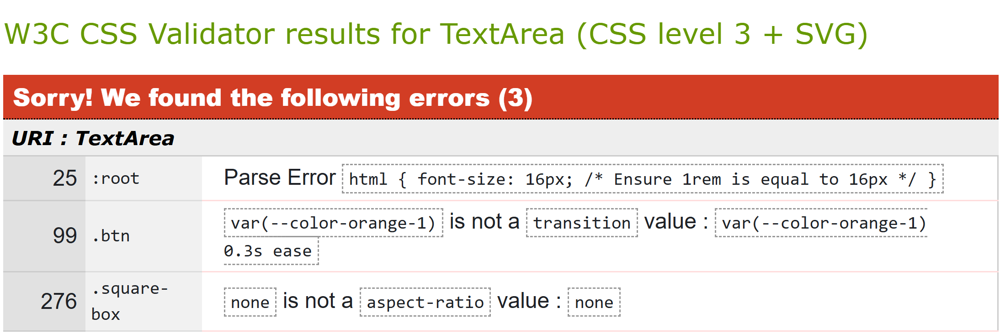

* The [W3C Markup Validator](https://validator.w3.org/) website was used to validate the HTML files to ensure there were no syntax errors. The validator found the following error, which was corrected:
    - An unnecessary "\" was found before a closing ">" at the end of a stylesheet link.

* The [JSHint](https://jshint.com/) website was used to validate the Javascript files to ensure there were no syntax errors.

 -  The following warning was returned for files that contain async functions: 'async functions' is only available in ES8 (use 'esversion: 8'). This warning was ignored because the latest fully ratified version is ECMAScript 2022 – the 13th edition of the specification. This version is widely accepted and implemented in modern browsers.
- Unnecessary semicolons - removed
- Missing semicolons - added
- Unnessary 'return' after 'throw Error' - removed
- "Attempting to override 'placeName' which is a constant." - const replaced with let

### Accessibility

Lighthouse in Chrome DevTools was used to confirm that the website is accessible. We have ensured that there is:

 - sufficient contrast between the text and background
 - semantic HTML (e.g., `header`)
 - valid and well-structured HTML to ensure compatibility with screen readers

**Lighthouse Report**

 | 


[Back to top ⇧](#mobility-mapper)

### Tools Testing

* [Chrome DevTools](https://developer.chrome.com/docs/devtools/) was used during the development process to:
    - view how the code renders in a web browser
    - evaluate how the code functions and ensure it behaves as expected
    - test responsiveness
    - debug and refine code

* Responsiveness
    
    - [Am I Responsive?](http://ami.responsivedesign.is/#) was used to check responsiveness of the pages across different devices.

    - Chrome DevTools was used to test responsiveness on different screen sizes during the development process.
    
### Manual Testing

* Browser Compatibility

Browser | Outcome | Pass/Fail  
--- | --- | ---
Google Chrome | No appearance, responsiveness nor functionality issues.| Pass
Mozilla Firefox | No appearance, responsiveness nor functionality issues. | Pass
Microsoft Edge | No appearance, responsiveness nor functionality issues. | Pass

* Device compatibility

Device | Outcome | Pass/Fail
--- | --- | ---
Lenovo Legion Slim 7 | No appearance, responsiveness nor functionality issues. | Pass
iPad Pro 11" | No appearance, responsiveness nor functionality issues. | Pass
Samsung Galaxy Ultra 22 | No appearance, responsiveness nor functionality issues. | Pass

* Elements Testing

**Landing Page**

Feature | Outcome | Pass/Fail
--- | --- | ---
Welcome screen | Displayed on landing on the website | Pass
Go to app button | On click, closes the landing welcome page (the div is removed), and the main app screen is shown | Pass

**Main app screen, shown on closing landing page**

Feature | Outcome | Pass/Fail
--- | --- | ---
Start and destination display sections | Hover effects are working as expected. | Pass
Map click | Clicking on the map shows a marker at the clicked location and shows a section below the map containing the address of the clicked location, and three buttons, which enable to user to set it as the start or destination location, or to go back | Pass
Map get current location button (crosshairs icon) | Zooms to users location and displays a circle with radius equal to the accuracy of the location displayed for two seconds | Pass

**Location Selection Options section**

Feature | Outcome | Pass/Fail
--- | --- | ---
Search text input field | Field is required and must contain letters and or numbers before submission. Invalid characters result in red text placeholder warning. | Pass
Current location button | Location of user is displayed on the map with the appropriate marker, and the location text is diplayed in the appropriate waypoint div. Map is centered on the location. | Pass 
Map Select button | Map expands to full screen, except for the header, and the user can click the map to select a location | Pass 
Saved places button | On click, the list of user saved places is shown and everthing else except the header is hidden | Pass 

**Text search results**

Feature | Outcome | Pass/Fail
--- | --- | ---
List of search results | Displayed correctly, while everything else is hidden except the header and the search text input box  | Pass
Individual search result | Clickable, and background turns light orange on hover  | Pass 
Clicked search result  | Displays the location in the appropriate start or destination display section, and add the corresonding marker on the map, with the map centered at that location | Pass
Exit button | Rmoves search results and returns to the prvious screen with the search location options still shown | Pass

**Map Select screen**

Feature | Outcome | Pass/Fail
--- | --- | ---
Expanded map | On clicking on the map a marker is shown at the clicked location, and a section below the map is created containing the address of the clicked location, and three buttons, which enable to user to set it as the start or destination location, or to go back | 

**Saved places screen**
Feature | Outcome | Pass/Fail
--- | --- | ---
List of saved places | Displayed correctly, while everything else is hidden except the header and the search text input box  | Pass
Individual place | Clickable, and background turns light orange on hover  | Pass 
Clicked saved place  | Displays the location in the appropriate start or destination display section, and add the corresonding marker on the map, with the map centered at that location | Pass
Exit button | Removes saved places and returns to the prvious screen with the search location options still shown | Pass

**Route generation**

Feature | Outcome | Pass/Fail
--- | --- | ---
Route generation | Route generated when both the start and destination location have been chosen. Solid blue line showing the route on the map, with a dashed line between any non-routable waypoints and the actual route. | Pass

**Error Modals**

Feature | Outcome | Pass/Fail
--- | --- | ---
Route generation | Error modal shown when the OpenRouteService API returns an error, tells user to try again with different locations. Close button closes the modal. | Pass
Text search Nominatim API request | Error modal with message to say the location search failed, and to try again | Pass


[Back to top ⇧](#mobility-mapper-frontend)

## Deployment

This website was developed using [Visual Studio Code](https://code.visualstudio.com/), which was then committed and pushed to GitHub using the terminal. It was deployed from the Github repository to GitHub Pages.

### Deploying on GitHub Pages

To deploy this website to GitHub Pages from its GitHub repository, take following steps:

1. Fork the repository (see [below](# Forking the Repository) for instructions on how to do this).
2. Go to the repository and click "Settings" (at the top of the page)
3. On the left-hand-side of the page, under "Code and automation", click "Pages"
4. Under "Build and deployment" > "Source", from the dropdown box select "Deploy from a branch"
5. Under "branch" select "main"
6. Click the "save" button
7. After a few moments, refresh the page and a link to your deployed page will appear

### Forking the Repository
Forking a GitHub Repository makes a copy of the original repository on your GitHub account, which you can view and/or make changes without affecting the original repository. To fork a repository:

1. Log into [GitHub](https://github.com/login) or [create an account](https://github.com/join).
2. Locate the [GitHub Repository](https://github.com/SonyaJane/mobility-mapper-frontend).
3. At the top of the repository, on the right side of the page, select "Fork"
4. You should now have a copy of the original repository in your GitHub account.

### Creating a Clone

How to run this project within a local IDE, such as VSCode:

1. Log into [GitHub](https://github.com/login) or [create an account](https://github.com/join).
2. Locate the [GitHub Repository](https://github.com/SonyaJane/mobility-mapper-frontend).
3. Under the repository name, click "Clone or download".
4. In the Clone under the HTTPs section, copy the clone URL for the repository.
5. In your local IDE open the terminal.
6. Change the current working directory to the location where you want the cloned directory to be made.
7. Type 'git clone', and then paste the URL you copied in Step 3.

```
git clone https://github.com/SonyaJane/mobility-mapper-frontend
```
8. Press Enter. Your local clone will be created.

Further reading and troubleshooting on cloning a repository from GitHub [here](https://docs.github.com/en/free-pro-team@latest/github/creating-cloning-and-archiving-repositories/cloning-a-repository)


## Finished Product

| Section | Mobile | Desktop | 
| --- | --- | --- |
|  |  |
| Main App Page | 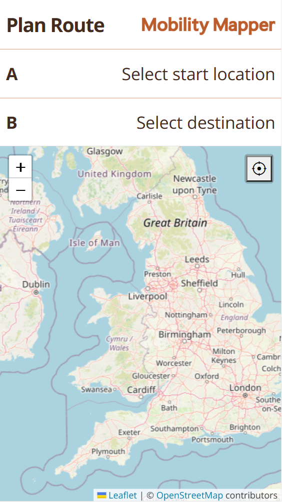  | 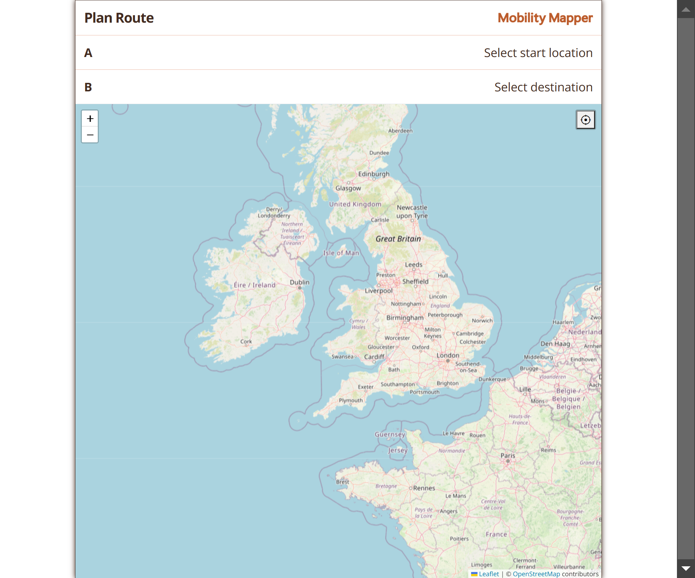 |
| Location Selection Options |  |  |
| Map Select Screen | 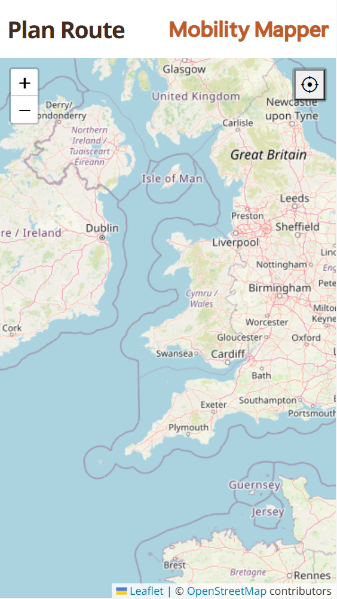 | 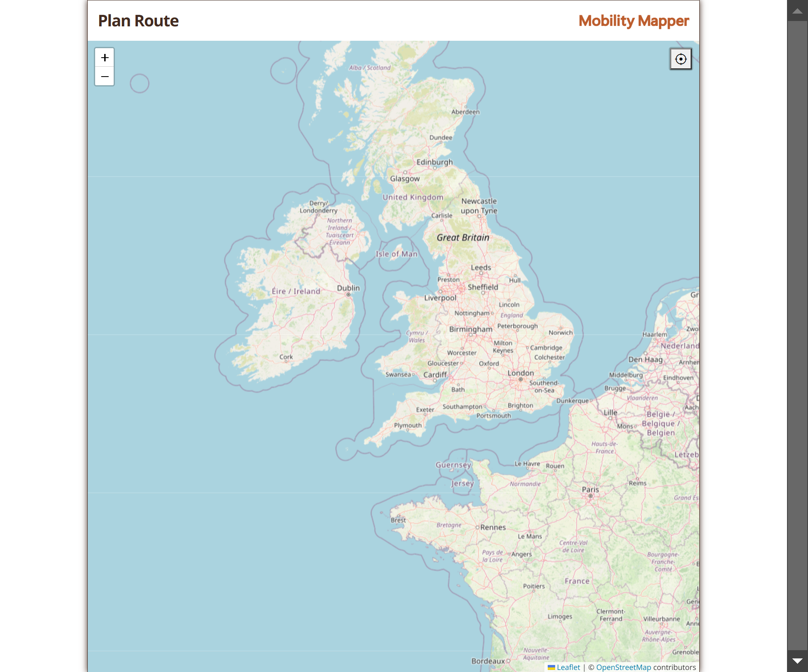 |
| Saved places | 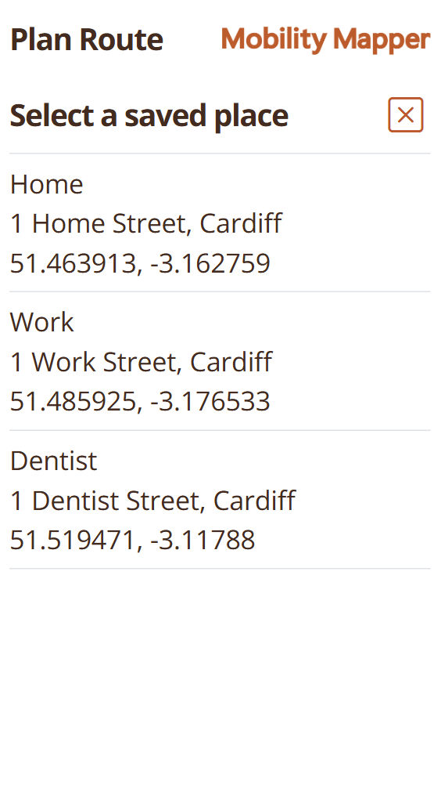 | 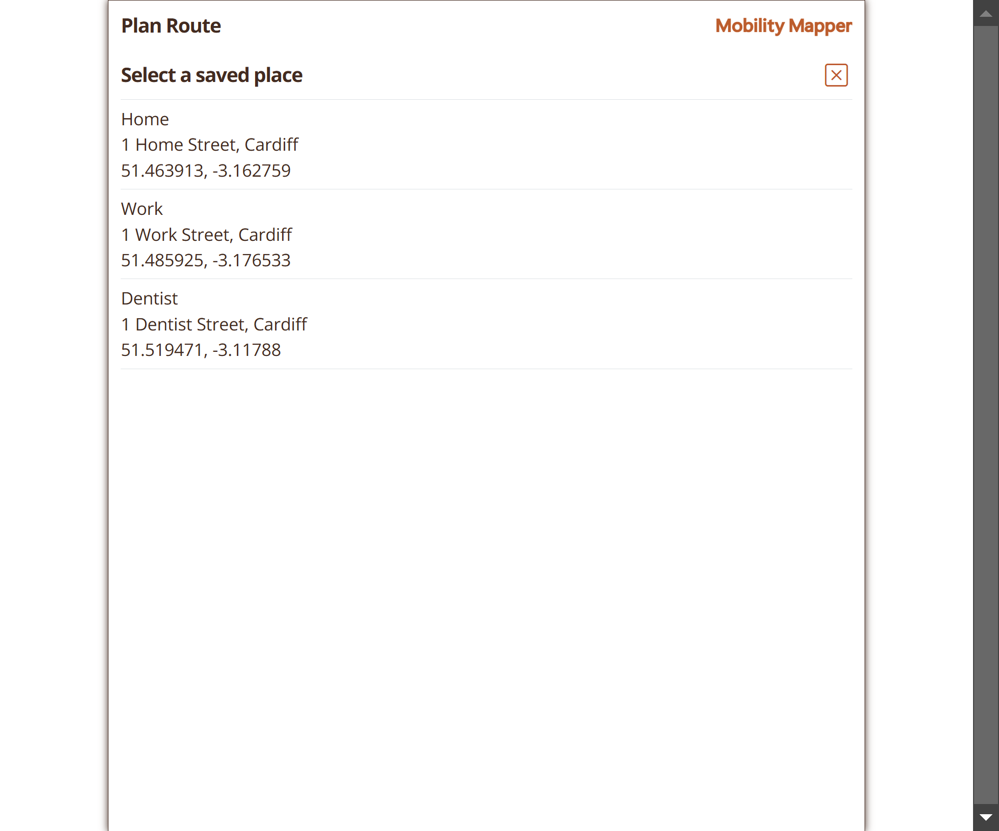 |
| Generated Route | 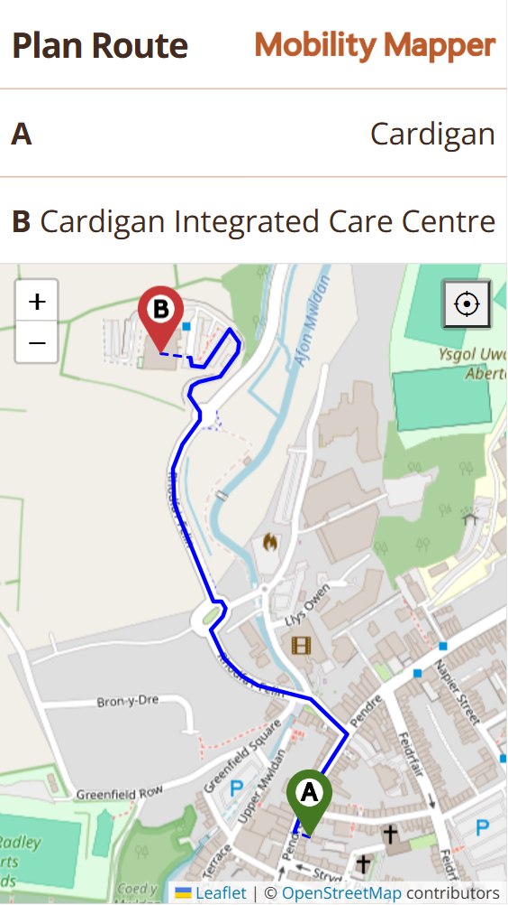 | 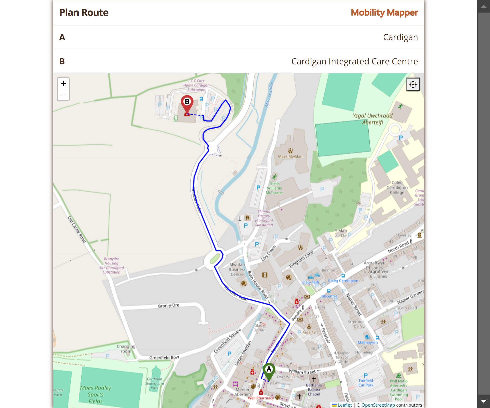 |
| Map Clicked Screen | 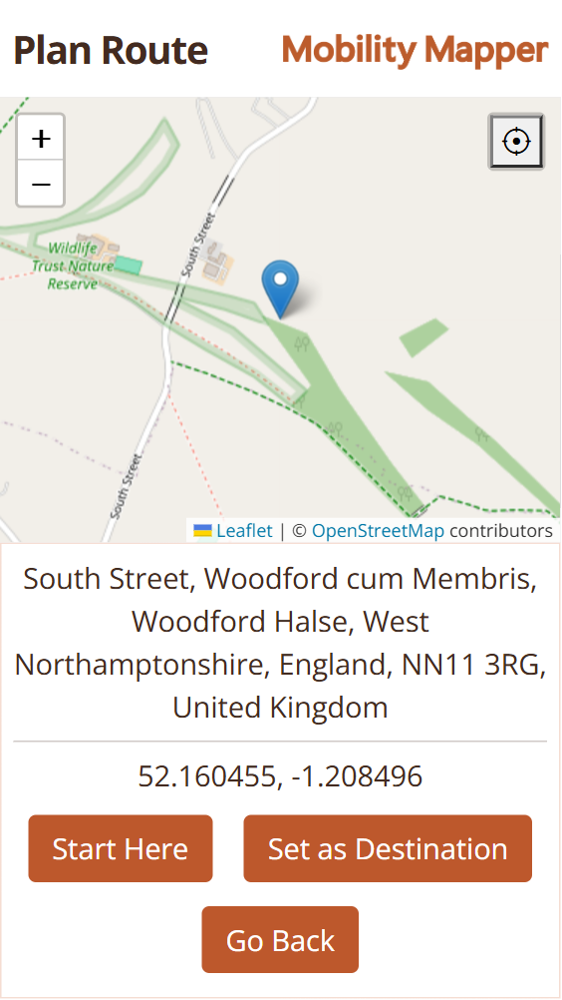 | 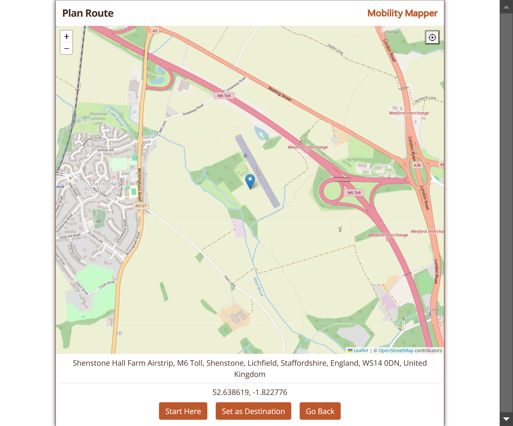 |

[Back to top ⇧](#mobility-mapper-frontend)

## Future Features

Currently the user saved places are stored in a Javascript object. We would like to be able to save these places on a backend server, and enable to the user to add, edit and delete them.

## Credits 

### Content

- All content was written by the developer.

### Media

- Mobility Mapper logo: Created by the developer in Inkscape

[Back to top ⇧](#mobility-mapper-frontend)